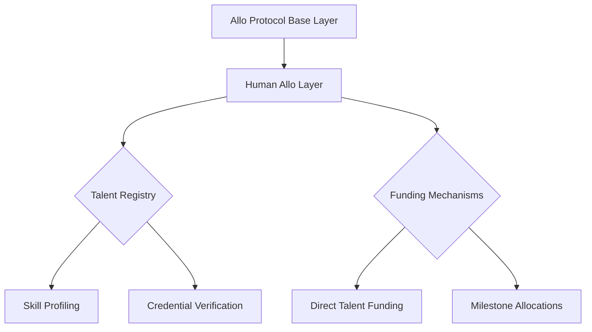
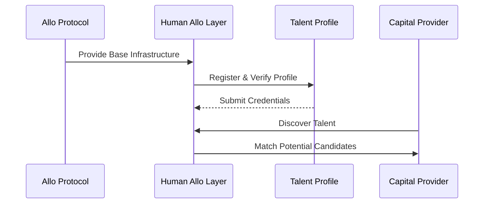

## The [Coordination Challenge](docs/concepts/coordination-challenge.md)

The [Human Allo](docs/concepts/human-allo.md) protocol addresses a fundamental paradox in [global problem-solving](docs/concepts/global-problem-solving.md): while we often cannot fully define specific [project solutions](docs/solutions/project-solutions.md) for complex challenges, we can identify the critical [expertise](docs/attributes/expertise.md) and [talent](docs/actors/talent.md) needed to maintain [ecosystem stability](docs/concepts/ecosystem-stability.md).

**Architecture Flow Diagram**

### Core Problem Statement

**[Information Asymmetry](docs/concepts/information-asymmetry.md)**:
- Traditional [funding models](docs/models/funding-models.md) require well-defined projects
- Critical expertise remains unfunded due to [coordination failures](docs/challenges/coordination-failures.md)
- [Global social networks](docs/networks/global-social.md) contain talent information but lack [funding pathways](docs/mechanisms/funding-pathways.md)

### Systemic Impact

**[Ecosystem Instability](docs/challenges/ecosystem-instability.md)**:
- Valuable [expertise](docs/attributes/expertise.md) remains [underutilized](docs/challenges/underutilization.md)
- Critical talent lacks [sustainable funding](docs/mechanisms/sustainable-funding.md)
- System [homeostasis](docs/concepts/homeostasis.md) becomes threatened
- [Coordination failures](docs/challenges/coordination-failures.md) persist despite available solutions

## Solution Framework

**[Human-Centric Approach](docs/approaches/human-centric.md)**:
- [Direct funding](docs/mechanisms/direct-funding.md) of expertise rather than projects
- [Talent-first capital allocation](docs/mechanisms/talent-first-allocation.md)
- [Ecosystem maintenance](docs/maintenance/ecosystem.md) through [human capital](docs/concepts/human-capital.md) support
- [Coordination mechanism](docs/mechanisms/coordination.md) for matching talent with funding needs

**Integration Strategy Sequence Diagram**

By focusing on funding [human capital](docs/concepts/human-capital.md) directly, [Human Allo](docs/concepts/human-allo.md) creates pathways for maintaining [ecosystem stability](docs/concepts/ecosystem-stability.md) even when specific project solutions cannot be predetermined. This approach ensures critical expertise remains available and supported within the system, regardless of project-specific constraints.