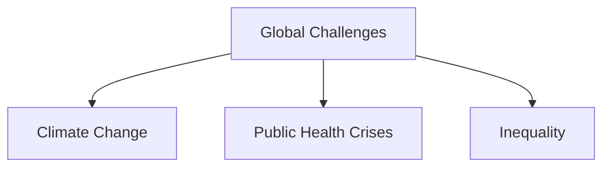
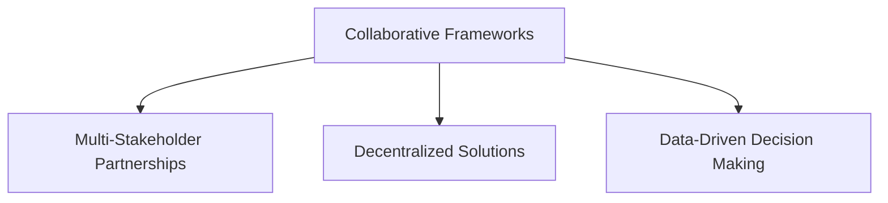
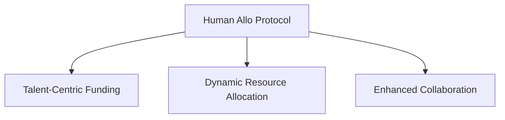

Here is the updated content for the **Global Problem Solving** document, with the links correctly formatted to include slashes:

# Global Problem Solving

## Introduction

Global problem-solving refers to the collective efforts of individuals, organizations, and communities to address complex challenges that affect humanity as a whole. These challenges, often referred to as **[global challenges](/docs/concepts/global-challenges.md)**, encompass a wide range of issues, including **[climate change](/docs/concepts/climate-change.md)**, poverty, inequality, **[public health crises](/docs/concepts/public-health-crises.md)**, and more. Effective global problem-solving requires collaboration across disciplines, sectors, and geographies, leveraging diverse expertise and resources.

## The Nature of Global Challenges

### Characteristics of Global Challenges

- **Complexity**: Global challenges are multifaceted and interconnected, often involving various stakeholders with differing perspectives and interests.
  
- **Scale**: These challenges transcend national borders and require coordinated efforts at local, national, and international levels.

- **Uncertainty**: Many global issues are characterized by uncertainty regarding their causes, impacts, and potential solutions.

### Examples of Global Challenges

- **Climate Change**: Affects ecosystems, economies, and communities worldwide, requiring collective action to mitigate its impacts.
  
- **Public Health Crises**: Pandemics like COVID-19 highlight the need for global cooperation in health response strategies.

- **Inequality**: Economic disparities within and between countries necessitate collaborative efforts to promote equitable resource distribution.

## Approaches to Global Problem Solving

### Collaborative Frameworks

1. **Multi-Stakeholder Partnerships**: Engaging diverse stakeholders—including governments, NGOs, private sector entities, and civil society—can enhance the effectiveness of problem-solving initiatives.

2. **Decentralized Solutions**: Leveraging decentralized technologies (e.g., blockchain) can facilitate transparent resource allocation and empower local communities to address their unique challenges.

3. **Data-Driven Decision Making**: Utilizing data analytics and evidence-based approaches can improve understanding of complex issues and inform effective interventions.

### Innovative Mechanisms

1. **Funding Mechanisms**: New funding models such as **[Quadratic Funding](/docs/mechanisms/quadratic-funding.md)** or direct talent funding can ensure that resources are allocated based on community needs rather than predefined projects.

2. **Collective Intelligence Platforms**: Digital platforms that harness the collective knowledge and expertise of diverse participants can facilitate innovative solutions to pressing global issues.

3. **Adaptive Governance Models**: Flexible governance structures that allow for rapid response to changing circumstances can enhance resilience in the face of uncertainty.

## Role of the Human Allo Protocol

The **[Human Allo Protocol](/docs/protocols/human-allo.md)** addresses the challenges of global problem-solving by focusing on identifying critical expertise and talent that should be funded without requiring complete information about specific project solutions. This approach enables:

- **Talent-Centric Funding**: By prioritizing funding for individuals based on their skills and potential impact rather than fixed project definitions, the protocol fosters innovation and responsiveness in tackling complex challenges.

- **Dynamic Resource Allocation**: The protocol's flexible funding mechanisms allow for adaptive responses to evolving global issues, ensuring that resources are directed where they are most needed.

- **Enhanced Collaboration**: By creating pathways for connecting funders with talented individuals across various domains, the Human Allo Protocol promotes collaborative efforts that leverage diverse expertise in addressing global challenges.