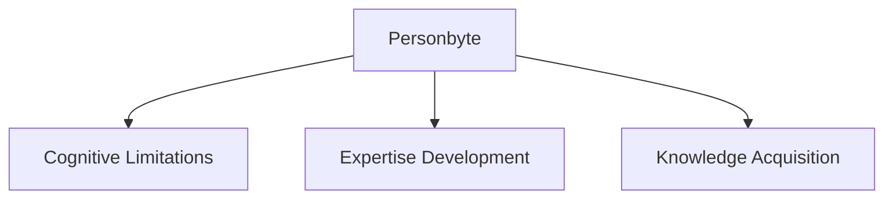
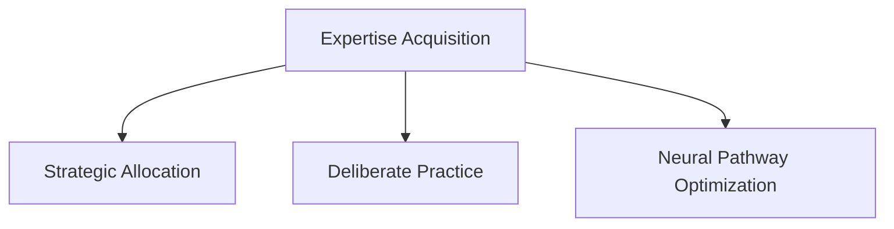
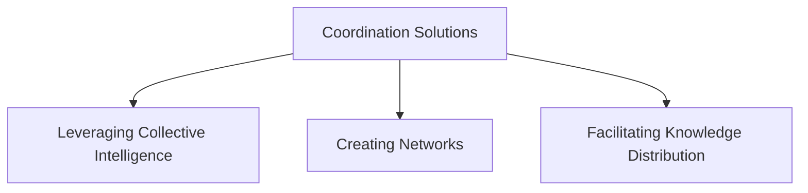

# Personbyte

## Introduction

The concept of **[personbyte](/docs/concepts/personbyte.md)** refers to the fundamental cognitive limit of an individual’s capacity to process, retain, and utilize knowledge and skills. This notion plays a critical role in understanding how **[expertise](/docs/attributes/expertise.md)** is developed and optimized within the constraints of human cognitive abilities. The personbyte encapsulates the maximum potential for **[knowledge acquisition](/docs/concepts/knowledge-acquisition.md)** and skill development, influencing how individuals engage with learning and expertise.

## Cognitive Capacity Constraints

### Definition of Personbyte

- **Cognitive Limitations**: The personbyte represents the finite resources available for cognitive processing. It encompasses the limits of attention, memory, and learning capabilities that individuals face in their quest for knowledge and skill enhancement.

### Implications of Personbyte

- **Expertise Development**: The development of **[expertise](/docs/attributes/expertise.md)** is constrained by an individual’s personbyte. As individuals strive to acquire new skills or knowledge, they must navigate these cognitive limits effectively to optimize their learning trajectories.

- **Knowledge Acquisition**: The process of acquiring knowledge is bounded by the individual’s ability to absorb and integrate information. Understanding these constraints is essential for designing effective learning strategies.

## Optimization Mechanisms

### Expertise Acquisition

1. **Strategic Allocation of Cognitive Resources**:
   - Individuals must allocate their limited cognitive resources efficiently to maximize expertise development.
   - This involves prioritizing certain areas of knowledge or skill that align with personal or professional goals.

2. **Deliberate Practice**:
   - Engaging in focused, deliberate practice within the constraints of the personbyte is crucial for skill mastery.
   - Continuous refinement of neural pathways through practice enhances learning outcomes.

3. **Neural Pathway Optimization**:
   - Optimizing neural pathways through repeated practice and engagement with material leads to improved retention and recall of information.

### Personbyte Limitations

- **Finite Time and Processing Capabilities**: Individuals have limited time to dedicate to learning, which constrains their ability to acquire new skills or knowledge.
  
- **Bounded by Neuroplasticity**: The brain's ability to reorganize itself (**neuroplasticity**) sets limits on how quickly and effectively new skills can be learned.

- **Selective Development**: Individuals must make choices about which skills or areas of knowledge to pursue based on their cognitive limitations.

## Strategic Implications for [Human Allo Protocol](/docs/protocols/human-allo.md)

### Coordination Solutions

1. **Leveraging Collective Intelligence**:
   - Utilizing collective intelligence can help overcome individual personbyte limitations by pooling knowledge and expertise from multiple sources.
  
2. **Creating Networks for Complementary Skill Development**:
   - Establishing networks that facilitate complementary skill development allows individuals to fill gaps in their own expertise through collaboration.

3. **Facilitating Knowledge Distribution**:
   - Promoting knowledge distribution across various talent profiles enhances collective problem-solving capabilities within organizations or communities.

## Developmental Dynamics

### Learning Trajectory

- **Focused Skill Cultivation**: Expertise emerges through deliberate, focused efforts in cultivating specific skills.
  
- **Strategic Time Allocation**: Effective learning requires careful planning of time spent on different areas within the constraints imposed by the personbyte.

- **Neural Pathway Refinement**: Continuous refinement of neural pathways leads to enhanced learning efficiency and skill acquisition.

### Scaling Mechanisms

1. **Collective Personbyte Approach**:
   - In organizational contexts, leveraging a collective approach to personbytes can amplify overall cognitive capacity.
  
2. **Institutional Memory**:
   - Developing institutional memory as a strategy for knowledge amplification allows organizations to retain valuable insights and experiences over time.

3. **Distributed Cognitive Resource Allocation**:
   - Allocating cognitive resources across teams or groups enhances problem-solving capabilities by allowing individuals to specialize in areas aligned with their strengths.
