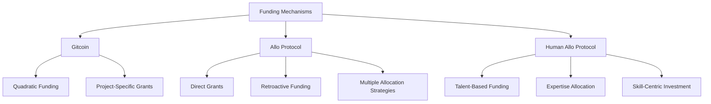
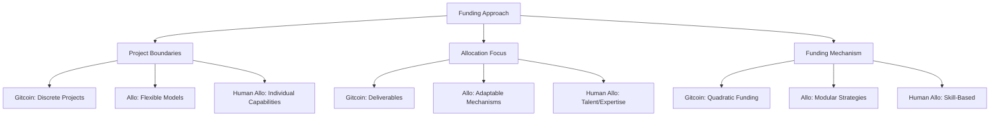

# Project Solutions in Funding Frameworks

## [Gitcoin's](/docs/organizations/gitcoin.md) Project Funding Approach

### Traditional Project Targeting
[Gitcoin](/docs/organizations/gitcoin.md) historically frames projects as **discrete initiatives** with specific outcomes:
- [Open source software development](/docs/domains/open-source-development.md)
- [Infrastructure projects](/docs/domains/infrastructure-projects.md)
- [Community-driven initiatives](/docs/mechanisms/community-driven-initiatives.md)
- [Ecosystem support programs](/docs/programs/ecosystem-support.md)

**Funding Characteristics**:
- Defined project scope
- Measurable deliverables
- [Quadratic funding](/docs/mechanisms/quadratic-funding.md) mechanisms
- Community-driven selection processes

## [Allo Protocol's](/docs/protocols/allo-protocol.md) Project Framing

### Expanded Project Definition
[Allo Protocol](/docs/protocols/allo-protocol.md) introduces a more **flexible project conception**:
- Modular funding mechanisms
- Customizable allocation strategies
- Adaptable eligibility criteria
- Scalable funding infrastructure

**Key Innovation**:
- Enables diverse funding models
- Supports multiple allocation strategies
- Allows community-specific implementation
- Provides transparent capital distribution

## [Allo L2: Human Allo Protocol](/docs/protocols/human-allo.md)

### Paradigm Shift: [Human Capital](/docs/concepts/human-capital.md) as Projects

**[Human Allo's](/docs/protocols/human-allo.md) Unique Approach**:
- **[Expertise](/docs/attributes/expertise.md)** becomes the primary funding target
- **Individual capabilities** replace traditional project boundaries
- **[Talent](/docs/actors/talent.md)** is treated as a dynamic, investable resource
- **[Skills](/docs/attributes/skills.md)** become the fundamental unit of allocation

### Comparative Framework

| Funding Target | [Gitcoin](/docs/organizations/gitcoin.md) | [Allo Protocol](/docs/protocols/allo-protocol.md) | [Human Allo Protocol](/docs/protocols/human-allo.md) |
|---------------|---------|--------------|---------------------|
| Core Focus | Software/Infrastructure | Flexible Project Models | Human Capabilities |
| Allocation Unit | Project Deliverables | Adaptable Mechanisms | [Expertise](/docs/attributes/expertise.md)/[Talent](/docs/actors/talent.md) |
| Funding Mechanism | [Quadratic Funding](/docs/mechanisms/quadratic-funding.md) | Modular Strategies | Skill-Based Allocation |

By reimagining projects as **[human potential](/docs/concepts/human-potential.md)**, [Human Allo Protocol](/docs/protocols/human-allo.md) transforms traditional funding models, treating individual [expertise](/docs/attributes/expertise.md) as the primary investment target.